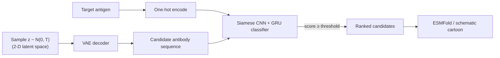

<div align="center">

# 🧬 Intelligent Antibodies

**A deep-learning pipeline for in-silico antibody design — sample candidate antibody sequences from a trained VAE, score them against a target antigen with a Siamese interaction classifier, and explore the results in an interactive dashboard.**

[](https://www.python.org/downloads/release/python-3120/)
[](https://docs.astral.sh/uv/)
[](https://streamlit.io/)
[](#project-status)

[Quickstart](#quickstart) • [Tutorial](#tutorial) • [How it works](#how-it-works) • [Project structure](#project-structure) • [Data](#data)

</div>

---

Therapeutic (monoclonal) antibodies are among the most effective treatments available today for chronic inflammatory diseases (Crohn's disease, lupus, multiple sclerosis) and certain cancers, and can be rapidly adapted against fast-mutating pathogens such as SARS-CoV-2. Yet only a few dozen are on the market — antibody design is slow, expensive, and still relies heavily on costly in-vitro screening and binding-energy estimates that are themselves hard to compute.

**Intelligent Antibodies** explores a faster, in-silico alternative: a **convolutional VAE** learns to generate plausible antibody sequences, and a **Siamese CNN+GRU classifier** predicts whether a generated candidate would actually bind a given antigen — turning candidate discovery into rejection sampling in a learned latent space instead of a physics-based energy calculation.

## Features

- 🧪 **Generative pipeline** — a 2-D-latent-space VAE samples candidate antibody sequences; a Siamese classifier scores each one against a target antigen (`intelligent_antibodies/modules/`).
- 📊 **Interactive dashboard** (Streamlit) — generate candidates, explore the sampled latent space with box/lasso selection, inspect per-candidate stats (hydrophobicity, charge, decode confidence), and view colorized sequences.
- 🧬 **Real structure prediction** — fold any candidate with [ESMFold](https://esmatlas.com/) (a practical, GPU-cluster-free stand-in for AlphaFold2) rendered as an interactive 3-D structure, colored by per-residue confidence.
- 🧰 **Runs out of the box** — no trained weights needed to try the dashboard: it detects whether real models exist under `run/models/` and otherwise shows clearly-labeled simulated results.
- 🗂️ **Full data pipeline** — scripts to fetch, parse, and equilibrate the [SAbDab](https://opig.stats.ox.ac.uk/webapps/sabdab-sabpred/sabdab) antibody-antigen dataset from scratch.

## Quickstart

Try the dashboard in under a minute — no data download or training required, it runs on simulated results out of the box.

```bash
git clone https://github.com/sebgra/intelligent_antibodies.git
cd intelligent_antibodies

uv sync                           # installs Python 3.12 + all dependencies
uv run streamlit run app/main.py  # opens the dashboard in your browser
```

> Everything here is managed with [uv](https://docs.astral.sh/uv/) — no `uv` yet? `curl -LsSf https://astral.sh/install.sh | sh` (see [the uv docs](https://docs.astral.sh/uv/getting-started/installation/) for other platforms).

Head to the **Generate** tab, check "Use bundled example antigen", and click **Launch generation**. You'll land on the **Results** tab with a full set of candidates, charts, and an interactive latent-space plot — all clearly labeled **simulated**, since no trained model is loaded yet. Follow the [tutorial](#tutorial) below to plug in real data and real trained models.

## Tutorial

A step-by-step walkthrough from "just cloned it" to generating and folding real candidates.

### 1. Explore the dashboard with simulated data

```bash
uv run streamlit run app/main.py
```

This is the [Quickstart](#quickstart) above. Worth doing first regardless of whether you plan to train real models — it's the fastest way to see what every tab does:

- **Generate** — pick an antigen (type a sequence, check the example box, or upload a FASTA file), and set the candidate count, interaction-score threshold, latent-space sampling temperature, and generated sequence length (the `vector_size` encoding window, 200 aa by default). Weights are stored per sequence length, so the dashboard loads the models trained for the length you pick — if none exist for it, it says which lengths are trained and falls back to simulated results.
- **Results → Overview** — KPIs, the score distribution across the sampled pool, and the top candidates.
- **Results → Latent space** — every sampled point in the VAE's 2-D latent space. **Drag a box or lasso** over a cluster of points to filter the other tabs down to just that selection.
- **Results → Sequence analysis** — length, hydrophobicity, and charge statistics, plus colorized sequences (by physicochemical residue class).
- **Results → Candidate explorer** — pick one candidate for a close-up: its colorized sequence, per-residue decode confidence, amino-acid composition, a schematic secondary-structure cartoon, and a button to fold it for real (see [step 5](#5-predict-a-real-structure)).
- **Dataset & Model** — real statistics computed from the actual SAbDab data and training-curve figures (nothing simulated on this tab).

### 2. Get the real data

Four scripts, run in order from the repo root, turn the raw SAbDab reference files (`data/SAbDab/All_PDB_files.txt`, `positive_samples.txt`, already included) into the tables the models train on. Every script resolves its own paths relative to the repo root, so they work from anywhere.

```bash
uv run python scripts/download_pdbs.py           # fetch FASTA files from RCSB
uv run python scripts/get_seq_table.py            # -> data/SAbDab/sequences.csv
uv run python scripts/get_interaction_table.py    # -> data/SAbDab/data.csv
uv run python scripts/filter_interaction_table.py # -> data/SAbDab/data_filtered.csv
```

| Script | What it does |
|---|---|
| `download_pdbs.py` | Fetches the FASTA file for every structure referenced in `All_PDB_files.txt` into `data/SAbDab/fasta/all_samples/`. Skips ids it already has (safe to resume); `--limit 20` for a quick smoke test, `--force` to re-fetch everything. |
| `get_seq_table.py` | Turns the downloaded FASTA files into `sequences.csv`: one row per chain, tagged `\|ab` or `\|ag` by whether its molecule description reads as an antibody chain. |
| `get_interaction_table.py` | Labels every pair of referenced structures `1` (interacting) or `0`, using `positive_samples.txt`, into `data.csv`. |
| `filter_interaction_table.py` | Drops pairs whose antibody or antigen side has no known sequence (e.g. a download failed), into `data_filtered.csv` — the file training actually reads. |

<details>
<summary>What the generated files look like</summary>

`data.csv`:

```
ab;ag;interaction
5kel|ab;5kel|ag;1
5kel|ab;6cwt|ag;0
...
```

`sequences.csv`:

```
seq_id;specie;sequence
5kel|ag;Zaire ebolavirus (strain Mayinga-76) (128952);IPLGVIHNSTLQVSDVDKLVCRDKLSSTNQLRSVGLNLEGNGVATDVPSATKRWGFRSGVPPKVVNYEAGEWAENCYNLEIKKPDGSECLPAAPDGIRGFPRCRYVHKVSGTGPCAGDFAFHKEGAFFLYDRLASTVIYRGTTFAEGVVAFLILPQAKKDFFSSHPLREPVNATEDPSSGYYSTTIRYQATGFGTNETEYLFEVDNLTYVQLESRFTPQFLLQLNETIYTSGKRSNTTGKLIWKVNPEIDTTIGEWAFWETKKNLTRKIRSEELSFTVVSNGAKNISGQSPARTSSDPGTNTTTEDHKIMASENSSAMVQVHSQGREAAVSHLTTLATISTSPQSLTTKPGPDNSTHNTPVYKLDISEATQVEQHHRRTDNDSTASDTPSATTAAGPPKAENTNTSKSTDFLDPATTTSPQNHSETAGNNNTHHQDTGEESASSGKLGLITNTIAGVAGLITGGRRTRR
5kel|ag;Zaire ebolavirus (128952);EAIVNAQPKCNPNLHYWTTQDEGAAIGLAWIPYFGPAAEGIYTEGLMHNQDGLICGLRQLANETTQALQLFLRATTELRTFSILNRKAIDFLLQRWGGTCHILGPDCCIEPHDWTKNITDKIDQIIHDFVDKTLPDLEVDDDD
...
```

</details>

### 3. Train the models

Two models, trained separately, both reading from the files step 2 produced:

```bash
uv run python scripts/train_vae.py        # the generator (antibody VAE)
uv run python scripts/train_siamese.py    # the discriminator (interaction classifier)
```

Both default to the full dataset and the original hyperparameters (200-epoch VAE, 100-epoch Siamese with early stopping) — slow on CPU. Smoke-test the pipeline first with a tiny slice:

```bash
uv run python scripts/train_vae.py --epochs 5 --limit 300
uv run python scripts/train_siamese.py --epochs 3 --limit 2000
```

A GPU is used automatically if TensorFlow can see one; otherwise it falls back to CPU. Run either script with `--help` for every option (filters, batch size, validation split, early-stopping patience, ...).

Each script saves its weights where the dashboard and `scripts/generate_antibodies.py` expect them, and refreshes the matching plot in `plots/`:

```
run/models/vae/vae-one-hot-200-encoder.keras
run/models/vae/vae-one-hot-200-decoder.keras
run/models/siamese/one-hot-200-model.h5
```

`run/` is gitignored — these are local artifacts, not something to commit.

### 4. Generate real candidates

Once both models exist, generation switches from simulated to real automatically — no flag to flip:

```bash
uv run streamlit run app/main.py
```

The **Generate** tab now shows "✅ Trained models found" and every subsequent run uses them for real; the **Results** banner says explicitly which one (simulated or real) produced what you're looking at.

Prefer the command line? `scripts/generate_antibodies.py` runs the same pipeline and writes a FASTA file of passing candidates:

```bash
uv run python scripts/generate_antibodies.py --antigen-id 6xe1 \
    --n-candidates 30 --threshold 0.85 --temperature 1.2
```

### 5. Predict a real structure

In **Results → Candidate explorer**, every candidate gets an instant schematic cartoon (a simplified secondary-structure heuristic — fast, offline, clearly labeled as illustrative). Click **"🔬 Fold with ESMFold"** underneath it to get a *real* predicted 3-D structure from the free public [ESM Atlas](https://esmatlas.com/) API, rendered interactively and colored by per-residue confidence (pLDDT) using AlphaFold's own color convention. This needs an internet connection and can take up to about a minute, which is why it's on demand rather than automatic — see [How it works](#how-it-works) for why ESMFold rather than AlphaFold2 itself.

## How it works



- **Generator — convolutional VAE** (`modules/models/VAEFull.py`): trained on antibody sequences only (one-hot encoded, Conv2D encoder / Conv2DTranspose decoder), with a 2-D latent space. Sampling `z = temperature × N(0, 1)` and decoding produces a new candidate sequence; `temperature` trades sampling diversity against decode fidelity.
- **Discriminator — Siamese classifier** (`modules/models/SiameseInteractionClassifier.py`): a shared Conv1D + bidirectional-GRU tower embeds both the candidate antibody and the target antigen; the embeddings are combined and passed through a sigmoid to predict an interaction probability.
- **Rejection sampling** (`modules/utils/inference.py`): candidates are sampled in batches and kept only if their predicted score clears a threshold — the same loop the dashboard and `scripts/generate_antibodies.py` both drive.
- **Dataset balancing** (`modules/dataset.py`): real antibody-antigen pairs are overwhelmingly non-interacting, so training downsamples the negative class to match the positive one before fitting the classifier.

## Project structure

```
intelligent_antibodies/
├── app/                      Streamlit dashboard (app/main.py) + mock/real generation bridges
├── intelligent_antibodies/   The installable package: models, data loading, encoding, inference
│   └── modules/
│       ├── models/           VAE + Siamese network definitions
│       ├── layers/           Custom Keras layers (sampling, variational loss)
│       └── utils/            Encoding schemes, inference loop, shared paths
├── scripts/                  Data pipeline + training + generation CLIs (see the tutorial above)
├── data/                     SAbDab / CoV-AbDab reference files and derived tables
├── notebooks/                Original research notebooks (EDA, encoding experiments, prototyping)
├── plots/                    Training-curve figures, refreshed by the training scripts
├── web_interface/            Earlier Flask + Vue.js prototype, superseded by app/ but kept for reference
└── run/                      Trained weights and generation outputs (gitignored, created locally)
```

## Data

Two datasets, both free to access:

- **[SAbDab](https://opig.stats.ox.ac.uk/webapps/sabdab-sabpred/sabdab)** — antibody-antigen immune complexes characterized by X-ray crystallography, across many species. This is the dataset the current pipeline trains on.
- **[CoV-AbDab](https://opig.stats.ox.ac.uk/webapps/covabdab/)** — SARS-CoV antibody/antigen pairs (`data/CoV-AbDab/`). Included for future work; not yet wired into the training scripts above.

### SAbDab

Two reference files drive the data pipeline ([step 2](#2-get-the-real-data) of the tutorial):

- **`All_PDB_files.txt`** — one id per constitutive antigen-antibody structure. The first four characters are the [RCSB PDB](https://www.rcsb.org/) id; the rest identify the chains within that structure.
- **`positive_samples.txt`** — pairs of structures known to form immune complexes, e.g. `4gms_J_N_E\t2vir_B_A_C`. The relation is **reciprocal and unordered** — either partner can be the antibody or the antigen side, so `filter_interaction_table.py` checks both orderings. Any pair *not* listed here is treated as a negative (non-interacting) sample.

FASTA files are fetched directly from SAbDab/RCSB, e.g.:

```
>1A2Y_1|Chain A|IGG1-KAPPA D1.3 FV (LIGHT CHAIN)|Mus musculus (10090)
DIVLTQSPASLSASVGETVTITCRASGNIHNYLAWYQQKQGKSPQLLVYYTTTLADGVPSRFSGSGSGTQYSLKINSLQPEDFGSYYCQHFWSTPRTFGGGTKLEIK
>1A2Y_2|Chain B|IGG1-KAPPA D1.3 FV (HEAVY CHAIN)|Mus musculus (10090)
QVQLQESGPGLVAPSQSLSITCTVSGFSLTGYGVNWVRQPPGKGLEWLGMIWGDGNTDYNSALKSRLSISKDNSKSQVFLKMNSLHTDDTARYYCARERDYRLDYWGQGTTLTVSS
>1A2Y_3|Chain C|LYSOZYME|Gallus gallus (9031)
KVFGRCELAAAMKRHGLANYRGYSLGNWVCAAKFESNFNTQATNRNTDGSTDYGILQINSRWWCNDGRTPGSRNLCNIPCSALLSSDITASVNCAKKIVSDGNGMNAWVAWRNRCKGTDVQAWIRGCRL
```

More structures can be pulled from SAbDab's own search tool, e.g. [antibody + protein antigen, with affinity](https://opig.stats.ox.ac.uk/webapps/sabdab-sabpred/sabdab/search/?ABtype=All&method=All&species=All&resolution=&rfactor=&antigen=Protein&ltype=All&constantregion=All&affinity=True&chothiapos=&restype=ALA) or [without](https://opig.stats.ox.ac.uk/webapps/sabdab-sabpred/sabdab/search/?ABtype=All&method=All&species=All&resolution=&rfactor=&antigen=Protein&ltype=All&constantregion=All&affinity=All&chothiapos=&restype=ALA); the [full search page](https://opig.stats.ox.ac.uk/webapps/sabdab-sabpred/sabdab/search/) has more filters. A backup copy of a similar dataset is available at [mit-ll/AlphaSeq_Antibody_Dataset](https://github.com/mit-ll/AlphaSeq_Antibody_Dataset).

### CoV-AbDab

Three tab-separated files under `data/CoV-AbDab/`, each row a SARS-CoV identifier plus a pair of sequence columns: `positive dataset.txt` and `negative dataset.txt` (interacting / non-interacting), and `independent test.txt` as a held-out set.

## Resources & references

- [Deep learning benchmark for antibody-antigen binding](https://www.sciencedirect.com/science/article/pii/S1093326322002431) — motivating article.
- [piercelab/antibody_benchmark](https://github.com/piercelab/antibody_benchmark) — a standard antibody-antigen docking benchmark.
- [emersON106/AbAgIntPre](https://github.com/emersON106/AbAgIntPre) ([paper](https://www.frontiersin.org/journals/immunology/articles/10.3389/fimmu.2022.1053617/full)) — a closely related Siamese-network approach to antibody-antigen interaction prediction, including its own curated SAbDab subset.
- Sequence encodings explored during prototyping: one-hot, [k-mer / Prot-Vec style encoders](https://github.com/anazhmetdin/protEncoder), and [Chaos Game Representation](https://dmnfarrell.github.io/bioinformatics/mhclearning).
- [ESM Atlas](https://esmatlas.com/) — the public ESMFold API this project's structure-prediction feature calls.

## Project status

This is an active research / learning project, not a production tool:

- No pretrained weights are shipped — train your own (see the [tutorial](#tutorial)) or use the dashboard's simulated mode to explore the interface first.
- The Siamese classifier's custom metrics (`accuracy`/`f1`/`mcc`) are simple, approximate formulas kept for continuity with earlier experiments, not calibrated, production-grade metrics.
- CoV-AbDab is included but not yet wired into training.
- No license has been chosen yet — please open an issue if you'd like to use this project and licensing matters to you.

Issues and pull requests are welcome.
